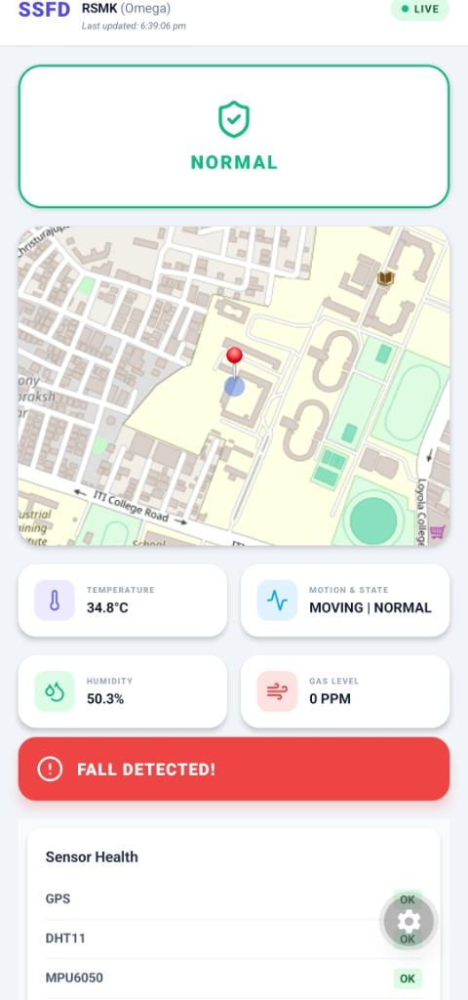
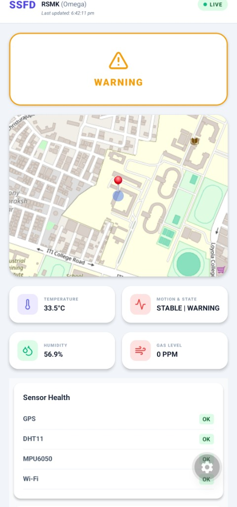
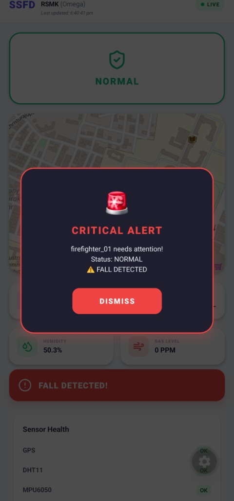

# FFSD — Fire Fighter Safety Device

<p align="center">
  <strong>Real-time firefighter vitals, GPS tracking, incident replay & geofencing — in your pocket.</strong><br/>
  A production-ready React Native + Expo mobile app for multi-firefighter fleet monitoring with tactical incident analysis.
</p>

<p align="center">
  
  
  
  
</p>

---

## 📖 Project Overview

FFSD (*Fire Fighter Safety Device*) is an end-to-end IoT system designed to monitor **multi-firefighter teams** in real-time. Wearable embedded devices stream live sensor telemetry (temperature, gas levels, motion, GPS location) to Firebase, where this **mobile app** displays live status, triggers emergency alerts, tracks historical incident data, manages geofence safety zones, and enables tactical incident replay analysis.

**Key Capabilities:**
- 📊 **Multi-Unit Fleet Monitoring** — Real-time status tracking for multiple firefighters simultaneously
- ⏱️ **Incident History & Replay** — Time-windowed historical data (1h/3h/6h) with playback speed controls (0.5x–4x)
- 🗺️ **Geofence Management** — Firebase-configured safe/danger zones with automatic breach alerts and colored zone overlays
- 🚨 **Failsafe Alerting** — Visual, audio, and haptic emergency notifications (no push notifications)
- 🎯 **Tactical Mapping** — MapLibre 3D map with multi-unit markers, zone visualization, and replay path playback

---

## 📸 Screenshots

<p align="center">
  

  

  
</p>

---

## 🛡️ Critical Alert System

The app features a multi-channel emergency alert system that triggers when `EMERGENCY`, `SOS`, or a **FALL** is detected:

- **🚨 Visual Popup**: A non-dismissible custom modal appears immediately.
- **🔊 Loud Audio**: A recurring buzzer sound (Incorrect/Wrong buzzer) plays at max volume.
- **📳 Vibration**: Persistent vibration pattern (5s bursts) to alert the user even if the phone is in a pocket.
- **🔄 Auto-Dismiss**: The alert popup, sound, and vibration stop automatically the moment the hardware reports a `NORMAL` state, ensuring responders only focus on active emergencies.

---

## 🏗️ System Architecture

```
Field Devices (Multi-Unit Fleet)
┌──────────────────────────────┐  ┌──────────────────────────────┐  ┌──────────────────┐
│   Device 1: firefighter_01   │  │   Device 2: firefighter_02   │  │   Device N ...   │
│                              │  │                              │  │                  │
│  DHT11 → Temp/Humidity  ┐    │  │  DHT11 → Temp/Humidity  ┐    │  │  DHT11 → ...  ┐  │
│  MPU6050 → Motion/Fall  ├─► │  │  MPU6050 → Motion/Fall  ├─► │  │  MPU6050 ─► │  │
│  MQ-series → Gas (PPM)  │   │  │  MQ-series → Gas (PPM)  │   │  │  MQ-series ─┼─►│
│  Neo-6M → GPS Location  ┘    │  │  Neo-6M → GPS Location  ┘    │  │  Neo-6M ────┘   │
└──────────────────────────────┘  └──────────────────────────────┘  └──────────────────┘
           │ WebSocket/RTDB                  │ WebSocket/RTDB                │ WebSocket/RTDB
           └─────────────────────────────────┴─────────────────────────────┬──────────────┘
                                                                           │
                            ┌──────────────────────────────────────────────┘
                            ▼
        ┌──────────────────────────────────────────────────────┐
        │    Firebase Realtime Database                        │
        ├──────────────────────────────────────────────────────┤
        │ firefighter_01/                                      │
        │   ├─ device_state, temp, gas, lat, lng, ...        │
        │ firefighter_02/                                      │
        │   ├─ device_state, temp, gas, lat, lng, ...        │
        │ incident_history/                                    │
        │   ├─ firefighter_01/ {timestamp1: {...}, ...}       │
        │   ├─ firefighter_02/ {timestamp2: {...}, ...}       │
        │ config/geofence_zones                               │
        │   ├─ zone_1: {name, type, center, radiusMeters}    │
        │   ├─ zone_2: {name, type, center, radiusMeters}    │
        └──────────────────────────────────────────────────────┘
                            │
                            ▼
        ┌──────────────────────────────────────────────────────┐
        │           FFSD Mobile App (React Native + Expo)      │
        │                                                      │
        │  Dashboard Screen                                    │
        │  ├─ Map (Multi-Unit Markers + Zone Overlays)        │
        │  ├─ Fleet Status Summary                            │
        │  ├─ Live Vitals Panel (Horizontal Scroll)           │
        │  ├─ Incident Replay (Timeline Scrubber)             │
        │  ├─ Geofence Config Selector                        │
        │  └─ Emergency Alert Modal (Failsafe)                │
        └──────────────────────────────────────────────────────┘
```

---

## 🎯 Core Features

| Feature | Description |
|---|---|
| **Multi-Unit Fleet Tracking** | Display live status, vitals, and location for all firefighters on a single tactical map. |
| **Incident Replay** | Load up to 6 hours of historical sensor data; scrub through timeline with chip-based navigation. |
| **Playback Controls** | Play/pause, speed control (0.5x / 1x / 2x / 4x), and automatic path drawing during replay. |
| **Geofence Zones** | Define safe/danger zones via Firebase config; app shows zone overlays and triggers targeted breach alerts. |
| **Live Vitals Panel** | Horizontal-scroll cards showing temperature, humidity, gas levels, and movement status per unit. |
| **Emergency Alerts** | Visual modal + audio alarm + vibration for EMERGENCY/SOS/FALL; auto-dismiss on NORMAL state. |
| **Fleet Status Summary** | Quick overview: total units, offline count, critical alert count. |
| **3D Map Visualization** | Vector/satellite layer toggle, dark/light mode sync, marker clustering. |
| **Real-time Synchronization** | Live Firebase listener for multi-unit telemetry streams. |
| **Failsafe Design** | No push notifications; all alerts are in-app (device-local) to guarantee visibility. |

---

## 🎨 Theme & UI

The FFSD dashboard is designed for both daylight and low-light tactical operations:

- **🌙 Dark Mode**: Cool blue/slate palette optimized for reduced eye strain and battery preservation.
- **☀️ Light Mode**: High-contrast design for maximum outdoor legibility and quick readability.
- **🔄 Instant Toggle**: Easy dark/light mode switch for switching between operational contexts.
- **Responsive Layout**: Adapts to device orientation; map and vitals panel stack for mobile, flow horizontally on tablets.

---

## � Project Structure

```
.
├── app.json                                  # Expo app config (name, slug, assets, EAS)
├── App.tsx                                   # Root component & theme provider
├── index.ts                                  # App entry point
├── package.json                              # Dependencies (Expo, Providers, Firebase, Maps)
├── tsconfig.json                             # TypeScript compiler options
│
├── src/
│   ├── screens/
│   │   └── Dashboard.tsx                     # Main UI: map, fleet tracking, replay, alerts
│   │
│   ├── components/
│   │   ├── MapWrapper.tsx                    # MapLibre integration (markers, zones, replay path)
│   │   ├── AnalyticsPanel.tsx                # Vitals cards (temp, humidity, gas, movement)
│   │   └── AlarmPlayer.tsx                   # Emergency audio + vibration handler
│   │
│   └── lib/
│       ├── firebase.ts                       # Firebase RTDB setup & connection
│       └── types.ts                          # TypeScript interfaces (DeviceState, FirefighterUnit, GeofenceZone)
│
├── assets/
│   ├── logo.png                              # FFSD logo (icon + splash)
│   └── [icon variants]                       # Adaptive icons for Android/iOS
│
└── docs/
    └── screenshots/                          # App screenshots for docs
```

---

## �🛠️ Tech Stack

### 📱 Mobile Application
| Layer | Technology | Version |
|---|---|---|
| Framework | **React Native** | 0.83.4 |
| Build Toolchain | **Expo** (SDK 55) | 55.x |
| Language | **TypeScript** | ~5.9 |
| Maps | **react-native-maps** | 1.27.x |
| UI & Icons | **lucide-react-native** | ^0.475 |
| Audio/Video | **react-native-webview** (Buzzer) | ^13.16 |

---

## 🔥 Firebase Realtime Database Structure

```json
// Path: firefighter_01/ (Live Telemetry)
{
  "device_state": "NORMAL",        // "NORMAL" | "WARNING" | "EMERGENCY" | "SOS" | "OFFLINE"
  "temperature": 32.5,
  "humidity": 45.0,
  "gas_ppm": 25,
  "falling": false,
  "movement": "MOVING",            // "MOVING" | "STILL"
  "location": {
    "lat": 12.9716,
    "lng": 77.5946
  }
}

// Path: incident_history/firefighter_01/{timestamp}/
{
  "lat": 12.9716,
  "lng": 77.5946,
  "temperature": 32.5,
  "humidity": 45.0,
  "gas": 25,
  "falling": false,
  "movement": "MOVING",
  "status": "NORMAL"
}

// Path: config/geofence_zones/
{
  "zone_1": {
    "name": "Safe Zone A",
    "type": "SAFE",
    "center": { "lat": 12.9716, "lng": 77.5946 },
    "radiusMeters": 500
  },
  "zone_2": {
    "name": "Danger Zone B",
    "type": "DANGER",
    "center": { "lat": 12.9800, "lng": 77.5850 },
    "radiusMeters": 300
  }
}
```

---

## 🚀 Getting Started

### Prerequisites

- Node.js 18+
- [Expo Go](https://expo.dev/go) installed on your Android/iOS device.

### 1. Clone & Install

```bash
git clone https://github.com/Rsmk27/firefighter-monitoring-device.git
cd firefighter-monitoring-device/FFSD
npm install --legacy-peer-deps
```

### 2. Configure Credentials

Create a `.env` file in the root (use `.env.example` as a template):

```env
EXPO_PUBLIC_FIREBASE_API_KEY=your-key
EXPO_PUBLIC_FIREBASE_DATABASE_URL=https://your-proj.asia-southeast1.firebasedatabase.app
...
```

### 3. Launch App

```bash
npx expo start
```
Scan the QR code with **Expo Go**.

---

## 🔒 Security

- **Zero Hardcoded Secrets**: All API keys and Firebase identifiers are strictly managed via environment variables.
- **Git Hardening**: `.env` and `google-services.json` are globally excluded from version control to prevent leaks.
- **Encrypted Data Streams**: Uses secure TLS connections to the Firebase Realtime Database.
- **Failsafe Logic**: In-app safety checks throw descriptive errors if configuration is missing, rather than using fallback keys.

---

## 📄 License & Team

© 2026 **Power Pulse Team**. All rights reserved.

Licensed under the MIT License.
